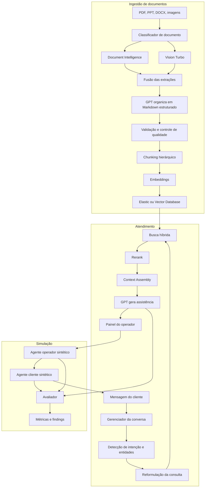
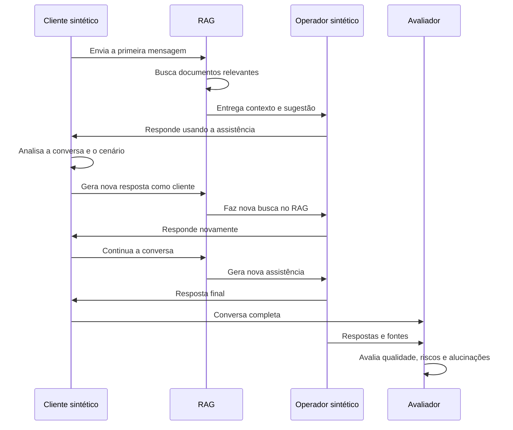

# Copiloto Assistente

MVP de um copiloto para operadores de atendimento. O sistema acompanha uma conversa, consulta uma base documental local, sugere respostas fundamentadas e permite simular atendimentos com agentes sintéticos.

## Objetivo do primeiro teste

Nesta primeira versão, o projeto permite:

- carregar documentos `.txt` e `.md` da pasta `data/docs`;
- criar uma busca RAG local com TF-IDF;
- conversar manualmente com um cliente simulado;
- gerar uma sugestão para o operador com Azure OpenAI;
- executar uma conversa sintética entre cliente e operador;
- avaliar a conversa com um juiz LLM;
- exibir fontes, trechos recuperados e pontuações.

Esta versão não depende de Elastic nem de embeddings externos. Isso reduz a complexidade do primeiro teste. Depois da validação, o retriever local pode ser substituído por Elastic híbrido, Azure AI Search ou outro banco vetorial.

## Arquitetura



No MVP atual, a parte de ingestão foi simplificada:

```text
TXT ou Markdown
    ↓
Chunking local
    ↓
TF-IDF
    ↓
Top-k trechos
    ↓
GPT gera a sugestão
```

## Estrutura

```text
copiloto_assistente/
├── app.py
├── requirements.txt
├── .env.example
├── data/
│   ├── docs/
│   │   └── politica_cancelamento.md
│   └── scenarios/
│       └── cancelamento.json
└── src/
    ├── __init__.py
    ├── azure_client.py
    ├── config.py
    ├── evaluator.py
    ├── rag.py
    └── simulation.py
```

## Configuração do `.env`

Crie um arquivo chamado `.env` na raiz e preencha:

```env
AZURE_OPENAI_ENDPOINT_5=
AZURE_OPENAI_API_KEY_PRIMARY_5=
AZURE_OPENAI_API_VERSION_5=2025-04-01-preview
AZURE_OPENAI_MODEL_5=gpt-5.4-mini-ptu

TOP_K=4
MAX_TURNS=8
```

O valor de `AZURE_OPENAI_MODEL_5` deve ser o nome exato do deployment criado no Azure OpenAI. Em Azure, o deployment pode ter um nome diferente do nome comercial do modelo.

Nunca envie o arquivo `.env` ao GitHub. O `.gitignore` deste projeto já bloqueia esse arquivo.

## Instalação no Windows

```powershell
git clone https://github.com/eduardo-data/copiloto_assistente.git
cd copiloto_assistente

python -m venv .venv
.\.venv\Scripts\Activate.ps1

python -m pip install --upgrade pip setuptools wheel
pip install -r requirements.txt

Copy-Item .env.example .env
```

Depois, edite o `.env` e execute:

```powershell
streamlit run app.py
```

## Como testar

### Teste manual

1. Abra a aba **Atendimento manual**.
2. Digite uma mensagem como: `Quero cancelar meu plano porque está caro.`
3. Clique em **Gerar assistência**.
4. Verifique intenção, resposta sugerida, próxima ação, alertas e fontes.

### Teste sintético

1. Abra a aba **Simulação sintética**.
2. Clique em **Executar cenário**.
3. O cliente sintético e o operador sintético conversarão por até oito turnos.
4. Ao final, um juiz avaliará fundamentação, aderência ao procedimento, resolução e riscos.

### Fluxo da conversa sintética



## Componentes futuros

### Etapa 2 — Ingestão multimodal

- Azure Document Intelligence para OCR e layout;
- Vision Turbo para diagramas, cards, preços e relações visuais;
- fusão de extrações;
- Markdown estruturado;
- metadados de página, versão, vigência e responsável.

### Etapa 3 — RAG corporativo

- Elastic BM25 + vetorial;
- embeddings multilíngues;
- filtros por produto, canal, público e vigência;
- reranking;
- citações obrigatórias;
- bloqueio de respostas sem evidência.

### Etapa 4 — Integração com atendimento real

- FastAPI;
- WebSocket;
- integração por API ou webhook com o chat do operador;
- painel lateral de assistência;
- feedback útil, incorreto ou documento desatualizado;
- observabilidade com Langfuse e Elastic.

## Limitações do MVP

- trabalha inicialmente apenas com `.txt` e `.md`;
- usa busca TF-IDF, não embeddings;
- não possui autenticação;
- não deve ser usado em produção;
- a avaliação por LLM é indicativa e deve ser combinada com métricas determinísticas;
- respostas não são enviadas automaticamente ao cliente.

## Segurança

A chave do Azure deve existir apenas no `.env` local. Caso uma chave seja exposta em commit, mensagem, print ou log, revogue-a no Azure e gere outra imediatamente.
