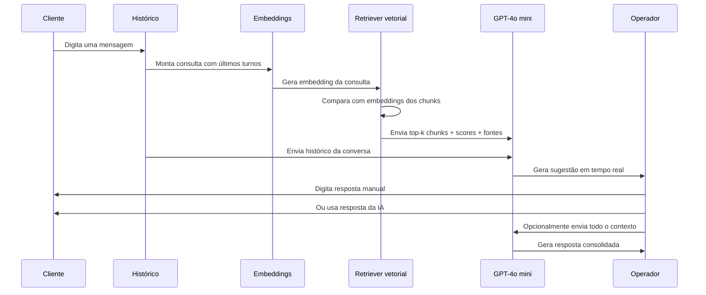
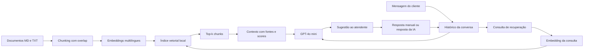

# Copiloto Assistente

MVP de um copiloto interativo para atendimento. O usuário pode atuar como cliente e como atendente, enquanto o sistema recupera informações da base documental e gera sugestões fundamentadas em tempo real.

## O que esta versão permite

- adicionar documentos `.md` e `.txt` à base;
- dividir os documentos em chunks com overlap;
- gerar embeddings multilíngues locais;
- recuperar os chunks mais relevantes por similaridade vetorial;
- manter o histórico completo da conversa;
- mostrar sugestões de atendimento com fontes e scores;
- responder manualmente ou usar a resposta sugerida pela IA;
- enviar toda a conversa e todo o contexto recuperado ao GPT-4o mini;
- exportar as evidências da simulação para apresentação e auditoria.

## Fluxo do atendimento interativo



## Arquitetura do MVP



## Interface da demonstração

A tela principal é organizada em três áreas:

1. **Cliente:** mensagem enviada pelo cliente e histórico da conversa.
2. **RAG e copiloto:** consulta gerada, chunks recuperados, scores, fontes e sugestão atualizada.
3. **Atendente:** resposta digitada manualmente ou preenchida a partir da sugestão da IA.

O botão **Enviar todo o contexto ao GPT** usa a conversa completa e os trechos recuperados para produzir uma resposta consolidada.

## Configuração do `.env`

Crie um arquivo `.env` na raiz:

```env
AZURE_STRUCTURING_ENDPOINT=
AZURE_STRUCTURING_KEY=
AZURE_STRUCTURING_DEPLOYMENT=gpt-4o-mini-2
AZURE_STRUCTURING_VERSION_COMPLETIONS=2024-02-15-preview

REQUEST_TIMEOUT_SECONDS=120

EMBEDDING_MODEL=sentence-transformers/paraphrase-multilingual-MiniLM-L12-v2
CHUNK_SIZE=900
CHUNK_OVERLAP=180
TOP_K=5
MAX_TURNS=12
```

O endpoint deve ser apenas o endereço-base do recurso Azure OpenAI, por exemplo:

```text
https://nome-do-recurso.openai.azure.com/
```

Nunca envie o arquivo `.env` ao GitHub.

## Instalação com `uv` no Windows

```powershell
git clone https://github.com/eduardo-data/copiloto_assistente.git
cd copiloto_assistente

uv venv .venv --python 3.11
.\.venv\Scripts\Activate.ps1
uv pip install -r requirements.txt

Copy-Item .env.example .env
```

Depois de preencher o `.env`, execute:

```powershell
uv run streamlit run app.py
```

## Atualização de uma cópia existente

```powershell
git checkout main
git pull origin main
uv pip install -r requirements.txt
uv run streamlit run app.py
```

## Base documental

Os documentos podem ser adicionados pela interface ou colocados em:

```text
data/docs/
```

Ao reindexar, o sistema executa:

```text
Documento
  → limpeza básica
  → chunking
  → overlap
  → embeddings
  → índice vetorial
  → recuperação top-k
```

## Evidências para apresentação

A simulação registra:

- mensagens do cliente e do atendente;
- origem da resposta do atendente: manual ou IA;
- consulta usada no retriever;
- chunks recuperados;
- scores de similaridade;
- fontes utilizadas;
- contexto enviado ao modelo;
- resposta sugerida e resposta consolidada.

Esses dados podem ser exportados em JSON para demonstração, análise e auditoria.

## Limitações do MVP

- aceita inicialmente documentos `.md` e `.txt`;
- mantém o índice vetorial em memória;
- não possui autenticação;
- não deve ser usado diretamente em produção;
- a qualidade depende da extração e da organização dos documentos;
- o GPT deve informar quando as fontes recuperadas não forem suficientes.

## Evoluções planejadas

- ingestão de PDF, DOCX, PPT e imagens;
- OCR e compreensão de layout;
- Elastic ou Azure AI Search;
- busca híbrida BM25 + vetorial;
- reranking;
- filtros por produto, canal, vigência e público;
- observabilidade com Langfuse e Elastic;
- integração com a plataforma real de atendimento.
