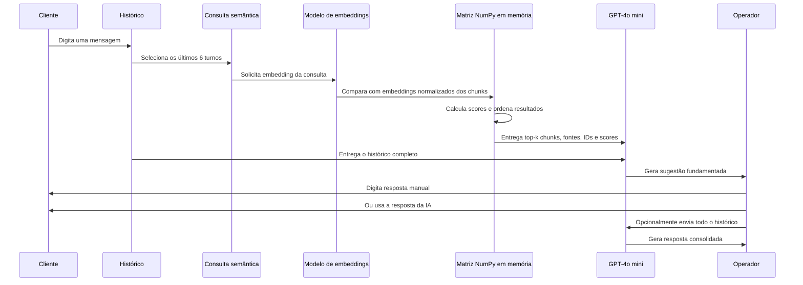
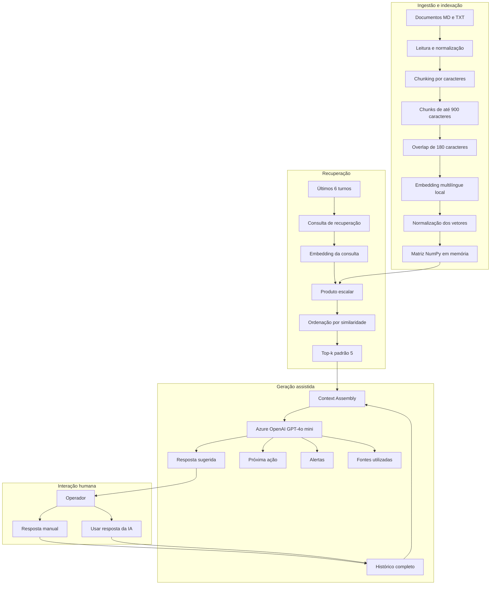

# Copiloto Assistente

MVP de um copiloto interativo para atendimento. O usuário pode atuar como cliente e como atendente, enquanto o sistema recupera informações da base documental e gera sugestões fundamentadas em tempo real.

## O que esta versão permite

- adicionar documentos `.md` e `.txt` à base;
- dividir os documentos em chunks com overlap;
- gerar embeddings multilíngues locais;
- recuperar os chunks mais relevantes por similaridade vetorial;
- manter o histórico completo da conversa;
- mostrar sugestões de atendimento com fontes e scores;
- responder manualmente ou usar a resposta sugerida pela IA;
- enviar toda a conversa e o contexto recuperado ao GPT-4o mini;
- exportar as evidências da simulação para apresentação e auditoria.

## Resumo técnico do RAG atual

| Componente | Implementação atual |
|---|---|
| Formatos de entrada | `.md` e `.txt` em `data/docs/` |
| Tipo de chunking | Chunking por caracteres, com cortes preferenciais em parágrafo, linha, final de frase e ponto e vírgula |
| Tamanho padrão | `900` caracteres por chunk |
| Overlap padrão | `180` caracteres entre chunks consecutivos |
| Identificação | `arquivo::índice`, por exemplo `catalogo.md::3` |
| Metadados mantidos | fonte, `chunk_id`, texto, posição inicial e posição final |
| Modelo de embedding | `sentence-transformers/paraphrase-multilingual-MiniLM-L12-v2` |
| Execução do embedding | Local, usando `sentence-transformers` |
| Normalização | Embeddings normalizados antes da busca |
| Banco vetorial | Não existe banco persistente neste MVP |
| Armazenamento atual | Matriz NumPy em memória durante a execução do Streamlit |
| Busca | Similaridade de cosseno calculada por produto escalar entre vetores normalizados |
| Recuperação | Top-k global, padrão `5` chunks |
| Threshold | Não aplicado nesta versão |
| Reranking | Não aplicado nesta versão |
| Consulta do retriever | Conteúdo dos últimos 6 turnos da conversa |
| LLM gerador | Azure OpenAI, deployment `gpt-4o-mini-2` |
| Contexto enviado ao LLM | Histórico completo + chunks recuperados + fonte + ID + score |

> **Importante:** a expressão “índice vetorial local” neste projeto significa uma matriz de embeddings mantida em memória. Ainda não é um banco vetorial como Elastic, Azure AI Search, Qdrant, Milvus, Weaviate ou PostgreSQL com pgvector.

## Como o chunking funciona

O projeto usa um splitter próprio orientado a caracteres. Ele não é chunking semântico nem hierárquico nesta versão.

Para cada documento:

1. o texto é normalizado, preservando as quebras de linha;
2. o sistema tenta criar uma janela de até `CHUNK_SIZE` caracteres;
3. antes de cortar exatamente no limite, procura um ponto de separação natural na segunda metade da janela;
4. a prioridade de corte é:
   - parágrafo: `\n\n`;
   - quebra de linha: `\n`;
   - final de frase: `. `;
   - ponto e vírgula: `; `;
5. quando não encontra um separador adequado, corta no limite definido;
6. o próximo chunk começa `CHUNK_OVERLAP` caracteres antes do final do chunk anterior.

Exemplo com a configuração padrão:

```text
Chunk 0: caracteres 0 até aproximadamente 900
Chunk 1: começa aproximadamente no caractere 720
Chunk 2: começa aproximadamente 180 caracteres antes do fim do Chunk 1
```

O overlap reduz o risco de uma informação importante ficar dividida exatamente na fronteira de dois chunks.

## Como os embeddings funcionam

O modelo padrão é:

```text
sentence-transformers/paraphrase-multilingual-MiniLM-L12-v2
```

Ele é carregado localmente pelo pacote `sentence-transformers`. Cada chunk é transformado em um vetor numérico. Os vetores são normalizados e convertidos para `float32`.

Na inicialização ou reindexação:

```text
Textos dos chunks
    ↓
SentenceTransformer.encode()
    ↓
Embeddings normalizados
    ↓
Matriz NumPy em memória
```

Na consulta:

```text
Últimos 6 turnos da conversa
    ↓
Embedding da consulta
    ↓
Comparação com todos os embeddings dos chunks
    ↓
Ordenação por score
    ↓
Top-k chunks
```

Como os vetores são normalizados, o produto escalar usado no código equivale à similaridade de cosseno.

## Onde os embeddings ficam armazenados

Neste MVP, os embeddings ficam somente em memória:

```python
self.embeddings: numpy.ndarray
```

Consequências:

- o índice é reconstruído quando o aplicativo reinicia;
- não existe persistência dos vetores em disco;
- não existe coleção, índice ou tabela em um banco externo;
- a busca compara a consulta com todos os chunks;
- funciona bem para demonstrações e bases pequenas;
- não é a arquitetura final indicada para milhares ou milhões de chunks.

A evolução prevista é substituir a matriz em memória por uma camada persistente, como Elastic com busca híbrida, Azure AI Search ou outro banco vetorial.

## Fluxo do atendimento interativo



## Arquitetura do MVP



## Etapas detalhadas de uma execução

### 1. Entrada da mensagem

A nova mensagem do cliente é adicionada à lista `st.session_state.conversation`.

### 2. Construção da consulta

O sistema pega no máximo os 6 últimos itens da conversa e concatena o conteúdo. Essa consulta tenta preservar o assunto recente sem usar todo o histórico na recuperação.

### 3. Vetorização da consulta

O mesmo modelo usado nos documentos gera o embedding da consulta. O vetor também é normalizado.

### 4. Busca vetorial

A matriz NumPy contém um vetor para cada chunk. O sistema calcula:

```text
scores = embeddings_dos_chunks @ embedding_da_consulta
```

Como todos os vetores estão normalizados, esse score representa similaridade de cosseno.

### 5. Seleção top-k

Os scores são ordenados do maior para o menor. Por padrão, os 5 chunks de maior pontuação são selecionados. Nesta versão, resultados de score baixo ainda podem entrar porque não existe threshold mínimo.

### 6. Montagem do contexto

Para cada chunk recuperado, o sistema inclui:

```text
FONTE
CHUNK_ID
SCORE
CONTEÚDO
```

### 7. Geração da sugestão

O GPT-4o mini recebe:

- histórico completo da conversa;
- contexto recuperado pelo RAG;
- instrução para não inventar preços, políticas, prazos ou procedimentos;
- obrigação de informar quando não houver evidência suficiente.

### 8. Decisão do operador

O operador pode:

- escrever sua própria resposta;
- usar a resposta sugerida pela IA;
- enviar a conversa completa novamente para gerar uma resposta consolidada.

## Interface da demonstração

A tela principal é organizada em três áreas:

1. **Cliente:** mensagem enviada pelo cliente e histórico desse papel.
2. **RAG e sugestão:** chunks, scores, fontes e sugestão atualizada.
3. **Atendente:** resposta manual ou resposta reutilizada da IA.

Outras abas:

- **Base documental:** upload, visualização dos chunks e reindexação;
- **Detalhes da execução:** consulta, contexto enviado e eventos registrados;
- **Arquitetura:** explicação executiva e técnica de cada componente.

## Configuração do `.env`

Crie um arquivo `.env` na raiz:

```env
AZURE_STRUCTURING_ENDPOINT=
AZURE_STRUCTURING_KEY=
AZURE_STRUCTURING_DEPLOYMENT=gpt-4o-mini-2
AZURE_STRUCTURING_VERSION_COMPLETIONS=2024-02-15-preview

REQUEST_TIMEOUT_SECONDS=120

EMBEDDING_MODEL=sentence-transformers/paraphrase-multilingual-MiniLM-L12-v2
CHUNK_SIZE=900
CHUNK_OVERLAP=180
TOP_K=5
MAX_TURNS=12
```

### Significado das variáveis

| Variável | Função |
|---|---|
| `AZURE_STRUCTURING_ENDPOINT` | Endpoint-base do recurso Azure OpenAI |
| `AZURE_STRUCTURING_KEY` | Chave de acesso ao Azure OpenAI |
| `AZURE_STRUCTURING_DEPLOYMENT` | Nome do deployment do modelo gerador |
| `AZURE_STRUCTURING_VERSION_COMPLETIONS` | Versão da API de Chat Completions |
| `REQUEST_TIMEOUT_SECONDS` | Tempo máximo da chamada ao modelo |
| `EMBEDDING_MODEL` | Modelo local usado para vetorizar documentos e consultas |
| `CHUNK_SIZE` | Limite aproximado de caracteres por chunk |
| `CHUNK_OVERLAP` | Quantidade de caracteres repetidos entre chunks |
| `TOP_K` | Quantidade de chunks devolvidos pela busca |
| `MAX_TURNS` | Parâmetro reservado para controle de conversas mais longas |

O endpoint deve ser apenas o endereço-base do recurso Azure OpenAI, por exemplo:

```text
https://nome-do-recurso.openai.azure.com/
```

Nunca envie o arquivo `.env` ao GitHub.

## Instalação com `uv` no Windows

```powershell
git clone https://github.com/eduardo-data/copiloto_assistente.git
cd copiloto_assistente

uv venv .venv --python 3.11
.\.venv\Scripts\Activate.ps1
uv pip install -r requirements.txt

Copy-Item .env.example .env
```

Depois de preencher o `.env`, execute:

```powershell
uv run streamlit run app.py
```

## Atualização de uma cópia existente

```powershell
git checkout main
git pull origin main
uv pip install -r requirements.txt
uv run streamlit run app.py
```

## Base documental

Os documentos podem ser adicionados pela interface ou colocados em:

```text
data/docs/
```

Ao reindexar, o sistema executa:

```text
Documento
  → normalização básica
  → chunking por caracteres
  → overlap
  → embedding multilíngue local
  → normalização dos vetores
  → matriz NumPy em memória
  → recuperação top-k
```

## Evidências para apresentação

A simulação registra:

- mensagens do cliente e do atendente;
- origem da resposta do atendente: manual ou IA;
- consulta usada no retriever;
- chunks recuperados;
- scores de similaridade;
- fontes utilizadas;
- contexto enviado ao modelo;
- resposta sugerida e resposta consolidada.

Esses dados podem ser exportados em JSON para demonstração, análise e auditoria.

## Limitações técnicas do MVP

- aceita inicialmente apenas `.md` e `.txt`;
- o chunking é baseado em caracteres, não em tokens ou semântica;
- o índice vetorial fica em memória e não é persistente;
- a busca é exaustiva sobre todos os chunks;
- não existe threshold mínimo de similaridade;
- não existe busca lexical BM25;
- não existe busca híbrida;
- não existe reranking;
- não existem filtros por metadados;
- não possui autenticação;
- não deve ser usado diretamente em produção.

## Evoluções planejadas

- ingestão de PDF, DOCX, PPT e imagens;
- OCR e compreensão de layout;
- chunking hierárquico ou semântico;
- persistência em Elastic ou Azure AI Search;
- busca híbrida BM25 + vetorial;
- threshold configurável;
- reranking;
- filtros por produto, canal, vigência e público;
- observabilidade com Langfuse e Elastic;
- integração com a plataforma real de atendimento.
