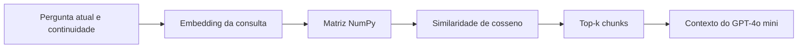
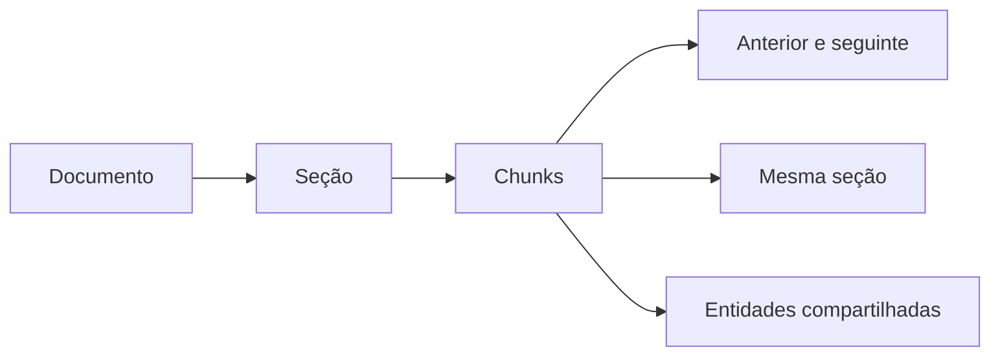
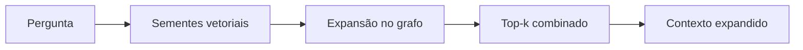
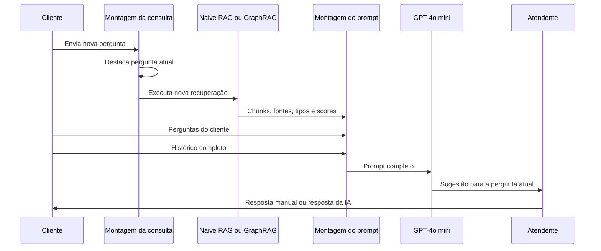

# Copiloto Assistente

MVP de um copiloto interativo para atendimento. O usuário pode atuar como cliente e como atendente, enquanto o sistema consulta uma base documental e gera sugestões fundamentadas em tempo real.

## O que esta versão permite

- adicionar documentos `.md` e `.txt`;
- criar chunks estruturados por títulos e seções;
- preservar tabelas Markdown inteiras como chunks únicos;
- gerar embeddings multilíngues localmente;
- escolher entre **Naive RAG** e **GraphRAG estrutural local**;
- refazer a recuperação a cada nova pergunta do cliente;
- enviar ao GPT a pergunta atual, todas as perguntas do cliente, o histórico completo e o contexto recuperado;
- responder manualmente ou utilizar a resposta sugerida pela IA;
- exportar a conversa, os eventos e as evidências da recuperação em JSON.

## Resumo técnico

| Componente | Implementação atual |
|---|---|
| Formatos | `.md` e `.txt` em `data/docs/` |
| Chunking | Estruturado por cabeçalhos, seções, parágrafos, tabelas e blocos de código |
| Texto comum | Agrupado por seção até `CHUNK_SIZE` |
| Texto longo | Dividido preferencialmente em parágrafo, linha, frase ou ponto e vírgula |
| Tabelas Markdown | Uma tabela inteira corresponde a um chunk atômico |
| Blocos de código | Preservados como chunks atômicos |
| Tamanho padrão | `900` caracteres para chunks textuais |
| Overlap padrão | `180` caracteres, aplicado a textos longos divididos |
| Embedding | `sentence-transformers/paraphrase-multilingual-MiniLM-L12-v2` |
| Execução | Local, com `sentence-transformers` |
| Armazenamento vetorial | Matriz NumPy `float32` em memória |
| Similaridade | Produto escalar entre embeddings normalizados, equivalente ao cosseno |
| Recuperação | Top-k padrão de `5` |
| Modos | Naive RAG ou GraphRAG estrutural local |
| Banco vetorial persistente | Ainda não existe |
| Banco de grafos persistente | Ainda não existe |
| LLM | Azure OpenAI, deployment `gpt-4o-mini-2` |
| Prompt do LLM | Pergunta atual + perguntas do cliente + histórico + contexto recuperado |

> Neste MVP, “índice vetorial” significa uma matriz NumPy em memória. O GraphRAG também utiliza estruturas em memória; ele não depende de Neo4j, Cosmos DB, Elastic ou outro banco de grafos.

## Chunking estruturado

O indexador não corta o documento apenas a cada quantidade fixa de caracteres. Primeiro identifica blocos estruturais.

### Títulos e seções

Cabeçalhos Markdown como `#`, `##` e `###` definem a seção à qual o chunk pertence. O nome da seção é armazenado como metadado e também entra no texto usado para gerar o embedding.

### Texto comum

Parágrafos da mesma seção são agrupados até o limite configurado. Quando o texto fica maior que `CHUNK_SIZE`, a divisão procura, nesta ordem aproximada:

1. separação entre parágrafos;
2. quebra de linha;
3. final de frase;
4. ponto e vírgula;
5. limite máximo de caracteres.

O overlap é aplicado apenas quando um bloco textual longo precisa ser dividido.

### Tabelas de preços

Uma tabela Markdown completa é tratada como um chunk atômico, mesmo que ultrapasse `CHUNK_SIZE`.

Exemplo reconhecido:

```markdown
| Produto | Preço | Condição |
|---|---:|---|
| Mesa Aurora | R$ 1.299,00 | À vista |
| Mesa Luna | R$ 1.499,00 | 10 parcelas |
```

Isso mantém no mesmo chunk:

- cabeçalhos;
- nomes dos produtos;
- preços;
- condições;
- relações entre colunas e linhas.

Para documentos com muitos preços, preservar a tabela corretamente é mais importante do que simplesmente trocar Naive RAG por GraphRAG.

## Embeddings

Modelo padrão:

```text
sentence-transformers/paraphrase-multilingual-MiniLM-L12-v2
```

Para cada chunk, o sistema gera o embedding usando:

```text
Documento: nome-do-arquivo
Seção: nome-da-seção
Tipo: text, table ou code
Conteúdo do chunk
```

Os vetores são normalizados e armazenados em uma matriz NumPy em memória. A consulta do cliente passa pelo mesmo modelo.

## Opção 1 — Naive RAG

O Naive RAG realiza busca vetorial direta.



### Quando começar por ele

- perguntas diretas de preço;
- documentos pequenos e bem estruturados;
- tabela com produto e valor no mesmo chunk;
- necessidade de comportamento mais simples e previsível.

## Opção 2 — GraphRAG estrutural local

O GraphRAG disponível neste MVP não é o pipeline completo do Microsoft GraphRAG. Ele é uma implementação local para demonstrar expansão por relacionamentos documentais.

### Construção do grafo

Cada chunk é um nó. O sistema cria arestas quando os chunks possuem alguma destas relações:

- sequência no mesmo documento;
- mesma seção;
- entidades compartilhadas;
- códigos compartilhados;
- valores ou nomes de produtos compartilhados.



### Recuperação GraphRAG

1. a busca vetorial encontra chunks sementes;
2. o grafo recupera chunks vizinhos relacionados;
3. sementes e vizinhos recebem scores combinados;
4. os melhores resultados formam o contexto.



### Quando experimentar GraphRAG

- preço, condição e descrição estão separados;
- a pergunta depende de relações entre produtos, planos ou categorias;
- informações estão distribuídas em várias seções;
- a pergunta usa referência indireta, como “essa mesa”, “esse plano” ou “e a entrega?”.

GraphRAG pode ampliar o contexto, mas também pode trazer informação vizinha desnecessária. Por isso, a interface permite comparar os dois modos.

## Atualização a cada nova pergunta

Cada nova mensagem enviada como cliente executa este ciclo:

1. remove da interface os chunks, sugestões e respostas consolidadas anteriores;
2. registra a nova pergunta no histórico;
3. marca a nova mensagem como pergunta principal;
4. monta uma nova consulta de recuperação;
5. executa novamente o Naive RAG ou GraphRAG;
6. monta um novo contexto;
7. chama o GPT-4o mini novamente.

O cache do Streamlit é utilizado somente para manter o modelo de embeddings e o índice documental carregados. Os resultados de consultas não são armazenados no cache.

Também existe o botão **Reprocessar pergunta atual**, que permite comparar a mesma pergunta nos dois modos.

## Consulta usada pelo retriever

A consulta destaca explicitamente a pergunta mais recente:

```text
PERGUNTA ATUAL DO CLIENTE:
Qual o preço dessa mesa?

PERGUNTAS ANTERIORES DO CLIENTE:
- Vocês têm mesa para seis lugares?

ÚLTIMA RESPOSTA DO ATENDENTE:
Temos alguns modelos disponíveis.
```

Assim, a recuperação não depende apenas de uma concatenação indiferenciada dos últimos turnos.

## Contexto enviado ao GPT

O GPT recebe quatro campos separados:

```text
PERGUNTA ATUAL DO CLIENTE

TODAS AS PERGUNTAS DO CLIENTE

HISTÓRICO COMPLETO DA CONVERSA

CONTEXTO RECUPERADO PELO RAG
```

Cada chunk do contexto contém:

- fonte;
- seção;
- tipo do chunk;
- ID;
- score;
- origem da recuperação;
- relações do grafo, quando aplicável;
- conteúdo completo.

## Fluxo do atendimento



## Configuração

Crie o arquivo `.env`:

```env
AZURE_STRUCTURING_ENDPOINT=
AZURE_STRUCTURING_KEY=
AZURE_STRUCTURING_DEPLOYMENT=gpt-4o-mini-2
AZURE_STRUCTURING_VERSION_COMPLETIONS=2024-02-15-preview

REQUEST_TIMEOUT_SECONDS=120

EMBEDDING_MODEL=sentence-transformers/paraphrase-multilingual-MiniLM-L12-v2
CHUNK_SIZE=900
CHUNK_OVERLAP=180
TOP_K=5
MAX_TURNS=12
```

O endpoint deve ser apenas o endereço-base do recurso Azure OpenAI.

Nunca envie o `.env` ao GitHub.

## Instalação com `uv`

```powershell
git clone https://github.com/eduardo-data/copiloto_assistente.git
cd copiloto_assistente

uv venv .venv --python 3.11
.\.venv\Scripts\Activate.ps1
uv pip install -r requirements.txt

Copy-Item .env.example .env
uv run streamlit run app.py
```

Para atualizar uma cópia existente:

```powershell
git checkout main
git pull origin main
uv pip install -r requirements.txt
uv run streamlit run app.py
```

## Evidências para apresentação

A interface mostra e exporta:

- estratégia selecionada;
- pergunta atual;
- todas as perguntas do cliente;
- consulta do retriever;
- chunks recuperados;
- tipo do chunk;
- scores;
- origem vetorial ou expansão do grafo;
- relações utilizadas;
- contexto documental;
- prompt completo enviado ao GPT;
- resposta manual ou gerada pela IA.

## Limitações do MVP

- entrada restrita a `.md` e `.txt`;
- tabelas precisam estar corretamente representadas em Markdown;
- vetores e grafo existem somente em memória;
- extração de entidades do grafo é baseada em regras locais;
- não existe reranker;
- não existe threshold mínimo de similaridade;
- não existe autenticação;
- não deve ser usado diretamente em produção.

## Evoluções recomendadas

- extração de PDF, PPT, DOCX e imagens;
- Docling ou Azure Document Intelligence para estrutura e tabelas;
- validação específica de tabelas de preço;
- Elastic, Azure AI Search ou pgvector para persistência vetorial;
- Neo4j, Cosmos DB Gremlin ou outro banco de grafos quando o grafo crescer;
- extração de entidades e relações com modelo especializado ou LLM;
- busca híbrida BM25 + vetorial;
- reranking;
- filtros por produto, vigência, canal e público;
- observabilidade com Langfuse e Elastic.
